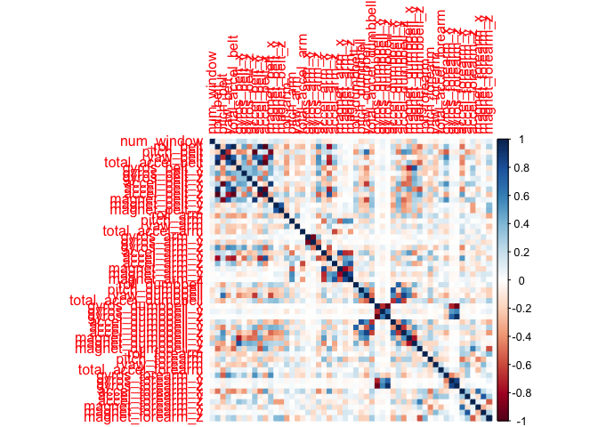
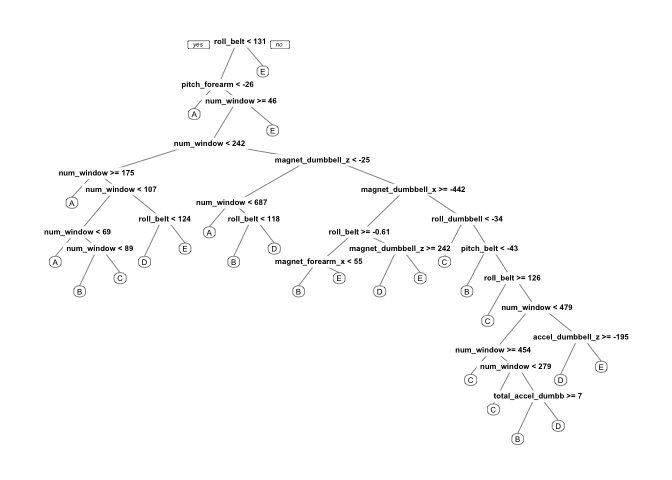

Practical Machine Learning Final Project - Quantified Self Movement Data
Analysis Report
================
Lucas Cruz

# R PPROJECT

This script was executed under R version 3.6.1 using Mac OS Mojave
version 10.14.6

\#SUMMARY 1. Reproductibility of the algorithm 2. Configuration and Data
Download 3. Reading Data 4. Cleaning Data 5. Partionning Training Set 6.
Data Modelling 7. Using the Random Forest Model to the Test Data Set

\#1. Reproductibility of the algorithm

To make this algorithm work, you need to check for certain packages and
setting a seed equals to mine. NB : To install a package in R, run the
command “install.packages(”nameofpackage)"

``` r
library(rattle)
```

    ## Rattle: A free graphical interface for data science with R.
    ## Version 5.3.0 Copyright (c) 2006-2018 Togaware Pty Ltd.
    ## Type 'rattle()' to shake, rattle, and roll your data.

``` r
library(caret)
```

    ## Loading required package: lattice

    ## Loading required package: ggplot2

``` r
library(rpart)
library(rpart.plot)
library(corrplot)
```

    ## corrplot 0.84 loaded

``` r
library(randomForest)
```

    ## randomForest 4.6-14

    ## Type rfNews() to see new features/changes/bug fixes.

    ## 
    ## Attaching package: 'randomForest'

    ## The following object is masked from 'package:ggplot2':
    ## 
    ##     margin

    ## The following object is masked from 'package:rattle':
    ## 
    ##     importance

``` r
set.seed(23343)
```

# 2\. Configuration and Data Download

I set the working directory. In my case I choose to create a folder
named “Final Project” in the default R folder being R Project

Data Sources : 1. Training Set :
<https://d396qusza40orc.cloudfront.net/predmachlearn/pml-training.csv>
2. Testing Set :
<https://d396qusza40orc.cloudfront.net/predmachlearn/pml-testing.csv>

I select the link for my 2 data
sets.

``` r
TrainDataLink <- "https://d396qusza40orc.cloudfront.net/predmachlearn/pml-training.csv"
TestDataLink <- "https://d396qusza40orc.cloudfront.net/predmachlearn/pml-testing.csv"
```

Thanks
“<http://web.archive.org/web/20161224072740/http:/groupware.les.inf.puc-rio.br/har>”
for sharing the data with Coursera for the Pratical Machine Learning
Final Project \!

# 3\. Reading Data

``` r
TrainDataRaw <- read.csv(TrainDataLink)
TestDataRaw <- read.csv(TestDataLink)
dim(TrainDataRaw);dim(TestDataRaw)
```

    ## [1] 19622   160

    ## [1]  20 160

The Training Data set contains 19622 observations and 160 variables. The
Testing Data set contains 20 observations and 160 variables. The
“classe” variable is what we need to predict in this particular case

# 4\. Cleaning Data

Here what we need to do is to remove the observations with missing
values, meaningless variables, …

First Cleaning : We remove the Near Zero Variance variables from both
data set

``` r
NearZeroVariance <- nearZeroVar(TrainDataRaw, saveMetrics = TRUE)
head(NearZeroVariance,20)
```

    ##                        freqRatio percentUnique zeroVar   nzv
    ## X                       1.000000  100.00000000   FALSE FALSE
    ## user_name               1.100679    0.03057792   FALSE FALSE
    ## raw_timestamp_part_1    1.000000    4.26562022   FALSE FALSE
    ## raw_timestamp_part_2    1.000000   85.53154622   FALSE FALSE
    ## cvtd_timestamp          1.000668    0.10192641   FALSE FALSE
    ## new_window             47.330049    0.01019264   FALSE  TRUE
    ## num_window              1.000000    4.37264295   FALSE FALSE
    ## roll_belt               1.101904    6.77810621   FALSE FALSE
    ## pitch_belt              1.036082    9.37722964   FALSE FALSE
    ## yaw_belt                1.058480    9.97349913   FALSE FALSE
    ## total_accel_belt        1.063160    0.14779329   FALSE FALSE
    ## kurtosis_roll_belt   1921.600000    2.02323922   FALSE  TRUE
    ## kurtosis_picth_belt   600.500000    1.61553358   FALSE  TRUE
    ## kurtosis_yaw_belt      47.330049    0.01019264   FALSE  TRUE
    ## skewness_roll_belt   2135.111111    2.01304658   FALSE  TRUE
    ## skewness_roll_belt.1  600.500000    1.72255631   FALSE  TRUE
    ## skewness_yaw_belt      47.330049    0.01019264   FALSE  TRUE
    ## max_roll_belt           1.000000    0.99378249   FALSE FALSE
    ## max_picth_belt          1.538462    0.11211905   FALSE FALSE
    ## max_yaw_belt          640.533333    0.34654979   FALSE  TRUE

``` r
TrainSet1 <- TrainDataRaw[, !NearZeroVariance$nzv]
TestSet1 <- TestDataRaw[, !NearZeroVariance$nzv]
dim(TrainSet1); dim(TestSet1)
```

    ## [1] 19622   100

    ## [1]  20 100

First Cleaning Conclusion : We have now a training data set of 19622
observations and 100 variables and a testing data set with 20
observations and 100 variables

Second Cleaning : We remove the columns that do not contribute much to
the accelerometer measurements

``` r
regex <- grepl("^X|timestamp|user_name", names(TrainSet1))
TrainingSet <- TrainSet1[, !regex]
TestingSet <- TestSet1[, !regex]
dim(TrainingSet);dim(TestingSet)
```

    ## [1] 19622    95

    ## [1] 20 95

Second Cleaning Conclusion : We now have a training set with 19622
observations and 95 variables and a testing set with 20 observations and
54 variables

Third Cleaning : We remove columns that have NA values in them.

``` r
Condition <- (colSums(is.na(TrainingSet))== 0)
TrainingSet <- TrainingSet[, Condition]
TestingSet <- TestingSet[, Condition]
dim(TrainingSet);dim(TestingSet)
```

    ## [1] 19622    54

    ## [1] 20 54

Third Cleaning Conclusion : We now have a training set with 19622
observations and 54 variables and a testing set with 20 observations and
54 variables

Now we can display the Correlation Matrix of Columns for the Training
Data Set

``` r
correlationMatrix <- cor(TrainingSet[,-length(names(TrainingSet))])
corrplot(correlationMatrix,method="color")
```

<!-- -->

# 5\. Partitionning Training Set

Please set the same seed because of reproductibility issues menntionned
in 1 - Reproductibility

``` r
set.seed(23343)
```

We set 70% of the values in the pure training data set and 30% in the
test validation data set. The validation data set will be helpful to
perform cross validation in future steps.

``` r
inTrain <- createDataPartition(TrainingSet$classe, p=0.70, list=FALSE)
Training <- TrainingSet[inTrain,]
Validation<- TrainingSet[-inTrain,]
```

The Dataset now consists of 54 variables with the observations divided
as follow : Training Data Set : 13737 observations; Validation Data :
5885 observations; Testing Data : 20 observations

# 6\. Data Modelling

## 1\. Decision Tree

We fit a predictive model for activity recognition using the “Decision
Tree” algorithm in R and we can now display the Decision Tree.

``` r
modelTree <- rpart(classe ~., data = Training, method = "class")
prp(modelTree)
```

<!-- -->

We should now estimate the performance of our model algorithm on the
validation data set

``` r
predictTree <- predict(modelTree, Validation, type = "class")
confusionMatrix(Validation$classe, predictTree)
```

    ## Confusion Matrix and Statistics
    ## 
    ##           Reference
    ## Prediction    A    B    C    D    E
    ##          A 1425  147    0   85   17
    ##          B  107  857   64   59   52
    ##          C    2   70  845  101    8
    ##          D   11   76   38  757   82
    ##          E    2   42    3   93  942
    ## 
    ## Overall Statistics
    ##                                         
    ##                Accuracy : 0.8201        
    ##                  95% CI : (0.81, 0.8298)
    ##     No Information Rate : 0.2629        
    ##     P-Value [Acc > NIR] : < 2.2e-16     
    ##                                         
    ##                   Kappa : 0.7731        
    ##                                         
    ##  Mcnemar's Test P-Value : < 2.2e-16     
    ## 
    ## Statistics by Class:
    ## 
    ##                      Class: A Class: B Class: C Class: D Class: E
    ## Sensitivity            0.9211   0.7190   0.8895   0.6913   0.8556
    ## Specificity            0.9426   0.9399   0.9633   0.9568   0.9707
    ## Pos Pred Value         0.8513   0.7524   0.8236   0.7853   0.8706
    ## Neg Pred Value         0.9710   0.9294   0.9784   0.9313   0.9669
    ## Prevalence             0.2629   0.2025   0.1614   0.1861   0.1871
    ## Detection Rate         0.2421   0.1456   0.1436   0.1286   0.1601
    ## Detection Prevalence   0.2845   0.1935   0.1743   0.1638   0.1839
    ## Balanced Accuracy      0.9319   0.8294   0.9264   0.8241   0.9132

``` r
accuracy <- postResample(predictTree, Validation$classe)
out_of_sample_error <- 1 - as.numeric(confusionMatrix(Validation$classe, predictTree)$overall[1])
```

``` r
print(accuracy)
```

    ##  Accuracy     Kappa 
    ## 0.8200510 0.7730794

``` r
print(out_of_sample_error)
```

    ## [1] 0.179949

We get an Estimated Accuracy of 82.01% for the Decision Tree Model and
the Estimated Out-of-Sample-Error is 17.99%

## 2\. Random Forest

We fit a predictive model for activity recognition using the “Random
Forest” algorithm in R because it is useful as it selects important
variables and is robust to correlated covariates for example in general.
We will use a 5-fold cross validation when using the
algorithm.

``` r
ModelRandomForest <- train(classe ~., method ="rf", data = Training, trControl= trainControl(method="cv", 5), ntree = 250)
ModelRandomForest
```

    ## Random Forest 
    ## 
    ## 13737 samples
    ##    53 predictor
    ##     5 classes: 'A', 'B', 'C', 'D', 'E' 
    ## 
    ## No pre-processing
    ## Resampling: Cross-Validated (5 fold) 
    ## Summary of sample sizes: 10989, 10991, 10989, 10989, 10990 
    ## Resampling results across tuning parameters:
    ## 
    ##   mtry  Accuracy   Kappa    
    ##    2    0.9933756  0.9916199
    ##   27    0.9967242  0.9958564
    ##   53    0.9951954  0.9939225
    ## 
    ## Accuracy was used to select the optimal model using the largest value.
    ## The final value used for the model was mtry = 27.

NB : This part of the algotrithm may be really slow to display so please
be patient.

We should now estimate the performance of our model algorithm on the
validation data set

``` r
PredictRandomForest <- predict(ModelRandomForest, Validation)
confusionMatrix(Validation$classe, PredictRandomForest)
```

    ## Confusion Matrix and Statistics
    ## 
    ##           Reference
    ## Prediction    A    B    C    D    E
    ##          A 1674    0    0    0    0
    ##          B    1 1134    0    4    0
    ##          C    0    2 1024    0    0
    ##          D    0    0    1  963    0
    ##          E    0    1    0    5 1076
    ## 
    ## Overall Statistics
    ##                                          
    ##                Accuracy : 0.9976         
    ##                  95% CI : (0.996, 0.9987)
    ##     No Information Rate : 0.2846         
    ##     P-Value [Acc > NIR] : < 2.2e-16      
    ##                                          
    ##                   Kappa : 0.997          
    ##                                          
    ##  Mcnemar's Test P-Value : NA             
    ## 
    ## Statistics by Class:
    ## 
    ##                      Class: A Class: B Class: C Class: D Class: E
    ## Sensitivity            0.9994   0.9974   0.9990   0.9907   1.0000
    ## Specificity            1.0000   0.9989   0.9996   0.9998   0.9988
    ## Pos Pred Value         1.0000   0.9956   0.9981   0.9990   0.9945
    ## Neg Pred Value         0.9998   0.9994   0.9998   0.9982   1.0000
    ## Prevalence             0.2846   0.1932   0.1742   0.1652   0.1828
    ## Detection Rate         0.2845   0.1927   0.1740   0.1636   0.1828
    ## Detection Prevalence   0.2845   0.1935   0.1743   0.1638   0.1839
    ## Balanced Accuracy      0.9997   0.9982   0.9993   0.9953   0.9994

``` r
accuracy <- postResample(PredictRandomForest, Validation$classe)
out_of_sample_error <- 1 - as.numeric(confusionMatrix(Validation$classe,PredictRandomForest)$overall[1])
```

``` r
print(accuracy)
```

    ##  Accuracy     Kappa 
    ## 0.9976211 0.9969910

``` r
print(out_of_sample_error)
```

    ## [1] 0.002378929

We get an Estimated Accuracy of 99.76% for the Decision Tree Model and
the Estimated Out-of-Sample-Error is 0.24%

## 3\. Conclusion

We get way better results with Random Forests, but it was to be expected
\! However, running a 5-fold Random Forest model is time consuming

# 7\. Using the Random Forest model to the Test Data Set

``` r
predict(ModelRandomForest, TestingSet[,-length(names(TestingSet))])
```

    ##  [1] B A B A A E D B A A B C B A E E A B B B
    ## Levels: A B C D E
